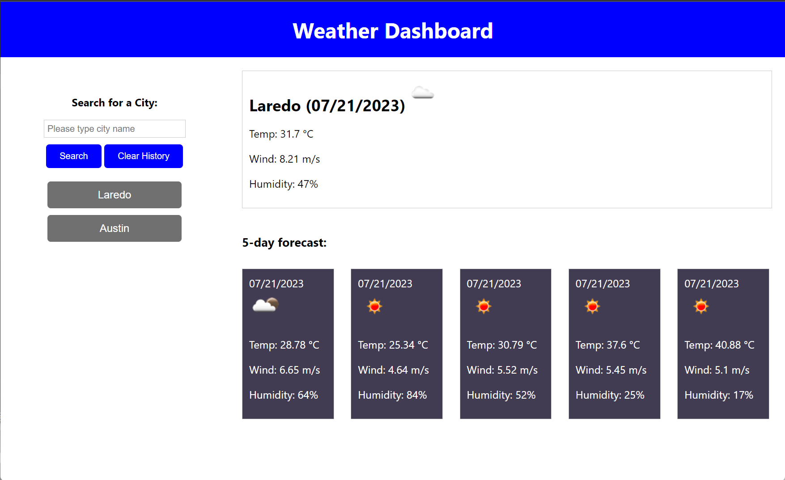

# Weather Dashboard App

## Table of Contents
- [Description](#description)
- [Usage](#usage)
- [Screenshot](#screenshot)
- [License](#license)

## Description
The Weather Dashboard App is a user-friendly web application that provides real-time weather information for any city along with a 5-day future forecast. With a simple and intuitive interface, the app allows users to access weather details and easily navigate between previously searched cities using saved buttons.

## Usage
To access the Weather Dashboard App, follow these steps:

1. Click on the following link to visit the application: [Weather Forecast App](https://sernat243.github.io/Weather-Dashboard/)

2. Once the app loads, you will see a search bar where you can enter the name of the city you want to check the weather for.

3. Click the "Search" button to get the current weather and the 5-day forecast for the provided city.

4. The app will save your searched cities and display them as buttons below the search bar. You can click on these buttons to quickly switch between the previously searched cities.

5. Click the Clear History button to clear your previous searches.

## Screenshot
Below is a screenshot of the Weather Forecast App showcasing its user interface:

## License
The Weather Forecast App is licensed under the MIT License. For more details, please refer to the [LICENSE](LICENSE) file.